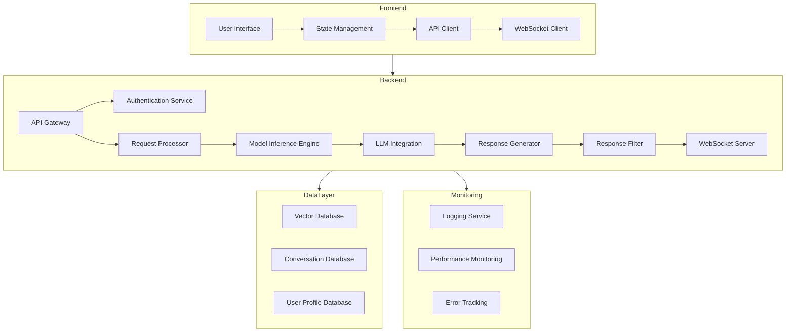
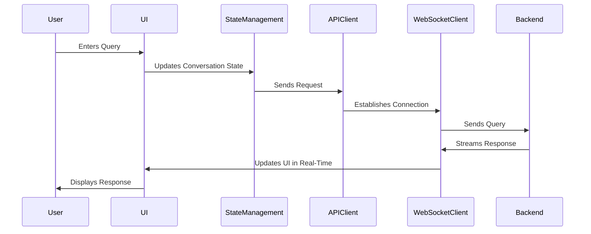
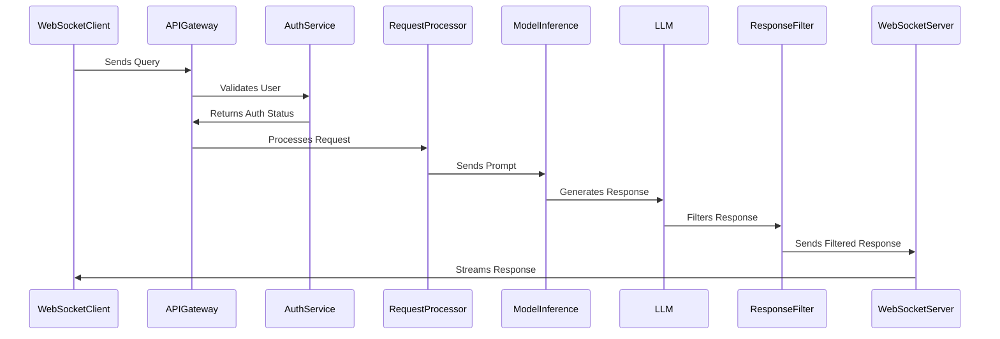
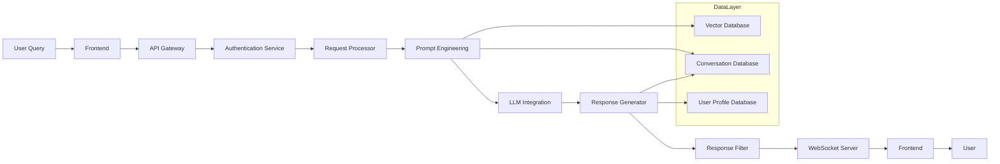
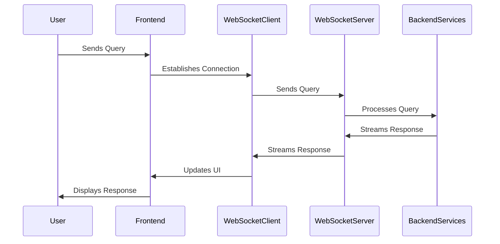

# Lumora
[figma](https://www.figma.com/design/ZBUWFGmlIvIwlFqq1hKrby/Untitled?node-id=33-421&t=BEAtzRgh4dnLqw5D-0)
## frontend
- yarn dev 

## llm
- create python env
 ```python git 

python3 -m venv lumoraenv
source lumoraenv/bin/activate
pip install -r requirements.txt

```


---

## System Architecture Diagrams**

### **High-Level Architecture Diagram**


---

### **Detailed Component Interactions**

#### **1. Frontend Workflow**


#### **2. Backend Workflow**


---

### **Data Flow Diagram**


---

### **WebSocket Communication Flow**


---

## **Explanation of Diagrams**

### **1. High-Level Architecture Diagram**
- **Frontend**: Handles user interactions and communicates with the backend.
- **Backend**: Processes requests, integrates with the LLM, and manages WebSocket communication.
- **Data Layer**: Stores conversation history, user profiles, and vector embeddings.
- **Monitoring**: Tracks system performance and logs errors.

### **2. Frontend Workflow**
- The user interacts with the UI, which updates the state and sends requests to the backend via the API client or WebSocket client.
- Responses are streamed back to the UI in real-time.

### **3. Backend Workflow**
- The API gateway validates requests and routes them to the appropriate services.
- The LLM generates responses, which are filtered and streamed back to the frontend.

### **4. Data Flow Diagram**
- Shows how data moves through the system, from user input to response generation and storage.

### **5. WebSocket Communication Flow**
- Illustrates the real-time communication between the frontend and backend using WebSockets.

---

## **Key Features in Detail**

### **1. Real-Time Communication**
- **WebSocket Server**:
  - Maintains persistent connections for low-latency communication.
  - Handles event-driven messaging for real-time updates.
- **Streaming Responses**:
  - LLM responses are streamed to the frontend as they are generated.
  - Provides a seamless and interactive user experience.

### **2. Personalization**
- **User Profile Database**:
  - Stores user preferences and interaction history.
  - Enables personalized responses based on past interactions.
- **Semantic Search**:
  - Uses vector embeddings to retrieve relevant context for each query.

### **3. Security**
- **Input Validation**:
  - Ensures that user inputs are safe and well-formed.
- **Toxicity Filtering**:
  - Filters LLM responses to prevent harmful or inappropriate content.
- **Payload Encryption**:
  - Encrypts data in transit to protect user privacy.

---

## **Future Enhancements**
1. **Advanced Prompt Engineering**:
   - Incorporate dynamic prompt templates and multi-turn context handling.
2. **Multi-Modal Support**:
   - Extend the system to handle images, audio, and other data types.
3. **Scalability Improvements**:
   - Implement load balancing and horizontal scaling for the WebSocket server.
4. **Enhanced Personalization**:
   - Use machine learning to predict user preferences and tailor responses.

---

