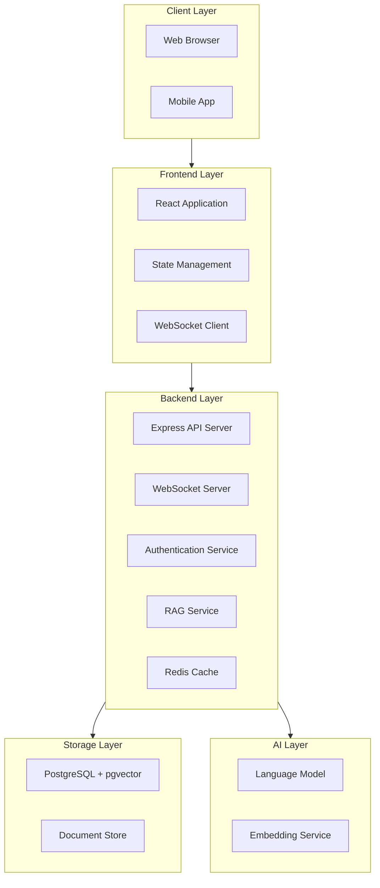
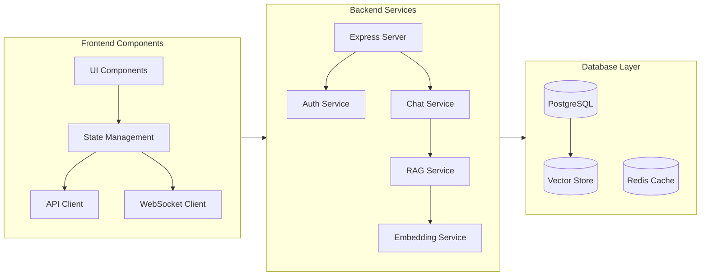
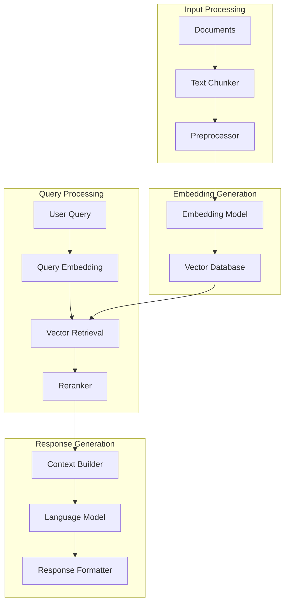
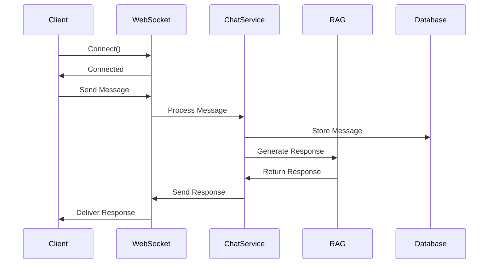

# ChatGPT-like Application Architecture Documentation

## System Architecture Diagrams

### High-Level System Architecture



### Detailed Component Architecture



### RAG Pipeline Architecture



### Real-time Communication Flow



## Enhanced Component Details

### 1. Frontend Detailed Structure

```
frontend/
├── public/
│   ├── assets/
│   │   ├── images/
│   │   └── fonts/
│   └── index.html
├── src/
│   ├── assets/
│   │   ├── styles/
│   │   │   ├── global.scss
│   │   │   ├── themes/
│   │   │   └── components/
│   │   └── icons/
│   ├── components/
│   │   ├── chat/
│   │   │   ├── ChatWindow/
│   │   │   │   ├── index.jsx
│   │   │   │   ├── styles.module.scss
│   │   │   │   └── hooks.js
│   │   │   ├── MessageList/
│   │   │   ├── MessageInput/
│   │   │   └── Message/
│   │   ├── common/
│   │   └── auth/
│   ├── features/
│   │   ├── chat/
│   │   │   ├── chatSlice.js
│   │   │   ├── chatSelectors.js
│   │   │   └── chatThunks.js
│   │   └── auth/
│   ├── hooks/
│   ├── services/
│   ├── utils/
│   └── config/
```

### 2. Backend Detailed Structure

```
backend/
├── src/
│   ├── config/
│   │   ├── database/
│   │   │   ├── migrations/
│   │   │   └── seeds/
│   │   ├── environment/
│   │   └── services/
│   ├── core/
│   │   ├── rag/
│   │   │   ├── chunker.js
│   │   │   ├── embedder.js
│   │   │   ├── retriever.js
│   │   │   └── generator.js
│   │   └── llm/
│   ├── api/
│   │   ├── routes/
│   │   ├── controllers/
│   │   ├── middleware/
│   │   └── validators/
│   ├── services/
│   │   ├── chat/
│   │   ├── auth/
│   │   └── vector/
│   └── utils/
```

### 3. Database Schema Details

```sql
-- Enhanced Users table
CREATE TABLE users (
    id SERIAL PRIMARY KEY,
    email VARCHAR(255) UNIQUE NOT NULL,
    password_hash VARCHAR(255) NOT NULL,
    first_name VARCHAR(100),
    last_name VARCHAR(100),
    preferences JSONB DEFAULT '{}',
    last_login TIMESTAMP,
    created_at TIMESTAMP DEFAULT CURRENT_TIMESTAMP,
    updated_at TIMESTAMP DEFAULT CURRENT_TIMESTAMP
);

-- Enhanced Conversations table
CREATE TABLE conversations (
    id SERIAL PRIMARY KEY,
    user_id INTEGER REFERENCES users(id),
    title VARCHAR(255),
    context JSONB,
    metadata JSONB DEFAULT '{}',
    is_archived BOOLEAN DEFAULT FALSE,
    created_at TIMESTAMP DEFAULT CURRENT_TIMESTAMP,
    updated_at TIMESTAMP DEFAULT CURRENT_TIMESTAMP
);

-- Enhanced Messages table
CREATE TABLE messages (
    id SERIAL PRIMARY KEY,
    conversation_id INTEGER REFERENCES conversations(id),
    role VARCHAR(50) NOT NULL,
    content TEXT NOT NULL,
    tokens INTEGER,
    metadata JSONB DEFAULT '{}',
    embedding vector(1536),
    created_at TIMESTAMP DEFAULT CURRENT_TIMESTAMP
);

-- Enhanced Vector store
CREATE TABLE document_chunks (
    id SERIAL PRIMARY KEY,
    document_id INTEGER,
    content TEXT NOT NULL,
    embedding vector(1536),
    metadata JSONB DEFAULT '{}',
    chunk_index INTEGER,
    chunk_size INTEGER,
    created_at TIMESTAMP DEFAULT CURRENT_TIMESTAMP
);

-- Document metadata table
CREATE TABLE documents (
    id SERIAL PRIMARY KEY,
    title VARCHAR(255),
    source VARCHAR(255),
    type VARCHAR(50),
    metadata JSONB DEFAULT '{}',
    created_at TIMESTAMP DEFAULT CURRENT_TIMESTAMP,
    updated_at TIMESTAMP DEFAULT CURRENT_TIMESTAMP
);

-- Create indexes
CREATE INDEX idx_conversation_user ON conversations(user_id);
CREATE INDEX idx_message_conversation ON messages(conversation_id);
CREATE INDEX idx_document_chunks_document ON document_chunks(document_id);
CREATE INDEX idx_embedding_vector ON document_chunks USING ivfflat (embedding vector_cosine_ops);
```

### 4. API Endpoints Detailed Specification

```javascript
/**
 * Chat API Endpoints
 */
// Create new conversation
POST /api/chat/conversations
Body: {
    title: string,
    context?: object
}

// Send message
POST /api/chat/conversations/:conversationId/messages
Body: {
    content: string,
    metadata?: object
}

// Get conversation history
GET /api/chat/conversations/:conversationId/messages
Query: {
    limit: number,
    offset: number,
    startDate?: string,
    endDate?: string
}

// Update conversation
PUT /api/chat/conversations/:conversationId
Body: {
    title?: string,
    context?: object,
    is_archived?: boolean
}

/**
 * Document API Endpoints
 */
// Upload document
POST /api/documents
Body: FormData {
    file: File,
    metadata?: object
}

// Process document
POST /api/documents/:documentId/process
Body: {
    chunk_size?: number,
    overlap?: number
}

/**
 * User API Endpoints
 */
// Update user preferences
PUT /api/users/preferences
Body: {
    theme?: string,
    language?: string,
    notification_settings?: object
}
```

### 5. WebSocket Events Specification

```javascript
// WebSocket event types
const WebSocketEvents = {
    // Connection events
    CONNECT: 'connect',
    DISCONNECT: 'disconnect',
    RECONNECT: 'reconnect',
    
    // Chat events
    MESSAGE_SENT: 'message:sent',
    MESSAGE_RECEIVED: 'message:received',
    MESSAGE_DELIVERED: 'message:delivered',
    MESSAGE_READ: 'message:read',
    
    // Typing events
    TYPING_START: 'typing:start',
    TYPING_STOP: 'typing:stop',
    
    // Stream events
    STREAM_START: 'stream:start',
    STREAM_DATA: 'stream:data',
    STREAM_END: 'stream:end',
    
    // Error events
    ERROR: 'error'
};

// WebSocket message structure
interface WebSocketMessage {
    type: string;
    payload: any;
    metadata: {
        timestamp: number;
        messageId: string;
        conversationId: string;
    };
}
```

## Configuration Management

```javascript
// Environment configuration
const config = {
    app: {
        port: process.env.PORT || 3000,
        env: process.env.NODE_ENV || 'development',
        secret: process.env.APP_SECRET
    },
    database: {
        host: process.env.DB_HOST,
        port: process.env.DB_PORT,
        name: process.env.DB_NAME,
        user: process.env.DB_USER,
        password: process.env.DB_PASSWORD,
        pool: {
            min: 2,
            max: 10
        }
    },
    redis: {
        host: process.env.REDIS_HOST,
        port: process.env.REDIS_PORT,
        password: process.env.REDIS_PASSWORD
    },
    ai: {
        model: process.env.AI_MODEL,
        temperature: 0.7,
        maxTokens: 2048,
        embeddingModel: process.env.EMBEDDING_MODEL
    }
};
```

## Error Handling

```javascript
// Global error handler
const errorHandler = (err, req, res, next) => {
    logger.error({
        message: err.message,
        stack: err.stack,
        timestamp: new Date(),
        requestId: req.id,
        path: req.path,
        method: req.method
    });

    res.status(err.status || 500).json({
        error: {
            message: err.message,
            code: err.code,
            requestId: req.id
        }
    });
};

// Custom error classes
class APIError extends Error {
    constructor(message, status = 500, code = 'INTERNAL_SERVER_ERROR') {
        super(message);
        this.status = status;
        this.code = code;
    }
}
```

## Monitoring and Logging Implementation

```javascript
// Logging configuration
const logger = winston.createLogger({
    level: config.app.env === 'production' ? 'info' : 'debug',
    format: winston.format.combine(
        winston.format.timestamp(),
        winston.format.json()
    ),
    transports: [
        new winston.transports.Console(),
        new winston.transports.File({ filename: 'error.log', level: 'error' }),
        new winston.transports.File({ filename: 'combined.log' })
    ]
});

// Metrics collection
const metrics = {
    requestDuration: new prometheus.Histogram({
        name: 'http_request_duration_ms',
        help: 'Duration of HTTP requests in ms',
        labelNames: ['method', 'route', 'status_code']
    }),
    
    activeConnections: new prometheus.Gauge({
        name: 'websocket_active_connections',
        help: 'Number of active WebSocket connections'
    }),
    
    messageProcessingTime: new prometheus.Histogram({
        name: 'message_processing_duration_ms',
        help: 'Time taken to process and respond to a message'
    })
};
```

Would you like me to elaborate on any particular aspect of these diagrams or add more specific details to any section?
